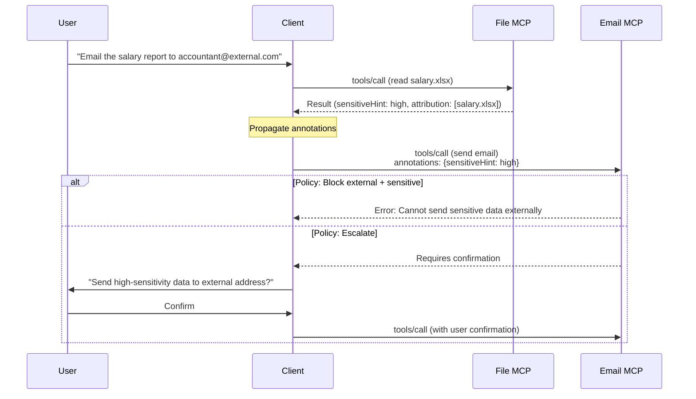
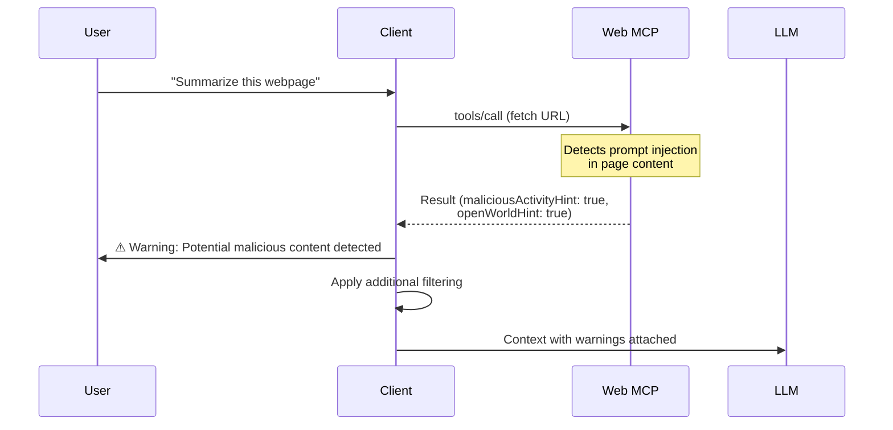

# SEP: Trust and Sensitivity Annotations

| Status  | Draft                                                                           |
| :------ | :------------------------------------------------------------------------------ |
| Type    | Standards Track                                                                 |
| Created | 2025-06-11                                                                      |
| Authors | @SamMorrowDrums                                                                 |
| Sponsor | @dend                                                                           |
| Issue   | [#711](https://github.com/modelcontextprotocol/modelcontextprotocol/issues/711) |

## Abstract

This SEP proposes trust and sensitivity annotations for MCP requests and responses, enabling clients and servers to track, propagate, and enforce trust boundaries on data as it flows through tool invocations. The proposal introduces annotations for marking data sensitivity, provenance, and potential malicious activity—creating primitives that hosts and registries can use to implement security policies.

The proposal introduces:

1. **Result annotations** for marking data characteristics in tool responses
2. **Request annotations** for propagating trust context to servers
3. **Propagation rules** ensuring sensitivity markers persist across session boundaries
4. **Malicious activity signaling** for security alerting and compliance

This pattern enables:

- **Data exfiltration prevention** by tracking when sensitive data flows to open-world destinations
- **Prompt injection defense** by marking untrusted data sources
- **Compliance workflows** via human-in-the-loop escalation for risky operations
- **Attribution tracking** for audit trails and provenance
- **Pre-execution assessment** via integration with Tool Resolution ([#1862](https://github.com/modelcontextprotocol/modelcontextprotocol/pull/1862)) for argument-derived annotations

> **Note**: This SEP provides primitives, not a complete security solution. It enables host applications and registries to define situation-specific policies while avoiding over-specification of universal rules.

## Motivation

### The Problem with Untracked Data Flow

As MCP adoption grows, data flows across tool boundaries without standardized trust metadata:

**1. Indirect Prompt Injection**

Data from untrusted sources (web pages, emails, user-generated content) enters the context without markers indicating its origin. An attacker can embed instructions in this data that the model may execute.

Recent research demonstrates the severity: Trail of Bits showed how [hidden content in GitHub issues](https://blog.trailofbits.com/2025/08/06/prompt-injection-engineering-for-attackers-exploiting-github-copilot/) can inject invisible prompt attacks that cause agents to insert backdoors in pull requests. The IBM/Google/Microsoft "Design Patterns for Securing LLM Agents" paper ([arXiv:2506.08837](https://arxiv.org/abs/2506.08837)) states:

> "Once an LLM agent has ingested untrusted input, it must be constrained so that it is impossible for that input to trigger any consequential actions."

**2. Data Exfiltration**

Sensitive information (credentials, PII, proprietary data) can be passed to tools that write to external destinations. Without sensitivity markers, clients cannot enforce policies like "don't email private repo content to external addresses."

**3. Cross-Organization Boundaries**

In multi-organization scenarios, what's "internal" in one context may be "external" in another. Current MCP has no way to express or propagate these distinctions.

**4. Compliance Requirements**

Regulated industries (healthcare, finance) need audit trails and sensitivity classifications. Without standardized annotations, each implementation reinvents this wheel.

### Enabling Security Architecture Patterns

Recent research proposes several design patterns for secure LLM agents. Trust annotations provide the **primitives** these patterns need at protocol boundaries:

| Pattern               | Trust Annotation Role                                                                            |
| :-------------------- | :----------------------------------------------------------------------------------------------- |
| **Plan-Then-Execute** | Planning phase uses `sensitiveHint`/`openWorldHint` to determine allowed tool sequences          |
| **Map-Reduce**        | Isolated agents return results with annotations; aggregation enforces sensitivity policies       |
| **Dual LLM**          | Privileged LLM receives annotations on quarantined results to make display decisions             |
| **ShardGuard**        | Coordination service uses annotations to select sanitization functions and opaque value policies |
| **FIDES (IFC)**       | Annotations serve as data labels for deterministic information flow control                      |

Without protocol-level annotations, each security architecture must reinvent data classification.

### Critical: Malicious Activity Detection

MCP servers are increasingly implementing detection for:

- Prompt injection attempts
- Secret/credential leakage
- Anomalous request patterns

Without standardized signaling, these security findings are lost between tool boundaries. The `maliciousActivityHint` annotation is essential for:

- User/admin alerting in compliance scenarios
- Human-in-the-loop review and escalation
- Audit logging of suspicious activity

### Example: Email MCP Scenario

Consider a user asking an AI to: "Take the salary spreadsheet and email it to my accountant"

With trust annotations:

1. File MCP marks spreadsheet data as `sensitiveHint: high` (contains salary data)
2. Context propagates sensitivity to Email MCP request
3. Email MCP detects external recipient (`openWorldHint: true` destination)
4. Policy triggers: block, escalate, or require user confirmation

Without trust annotations: The email goes through with no checks.

## Specification

### Terminology

**Agent session** (or simply "session" in this SEP): A client-side concept representing a sequence of user interactions where subsequent requests share the same agent context window. This is the conversation or task boundary as perceived by the user—for example, a chat thread in an AI assistant or a task execution in an agentic workflow.

This is distinct from **MCP session**, which refers to the protocol-level connection between a client and server (as defined in the MCP specification). Trust annotations propagate across an _agent session_, which may span multiple MCP sessions or interact with multiple MCP servers.

### Annotation Types

#### Result Annotations

Tools **MAY** include these annotations in their results to describe data characteristics:

```typescript
interface TrustAnnotations {
  /**
   * Indicates data is internal/private to an organization.
   * Not necessarily highly sensitive, but not for public release.
   * Example: internal documentation, non-public roadmaps
   */
  privateHint?: boolean;

  /**
   * Indicates presence of sensitive data with granularity levels.
   * - low: Internal-only, not highly confidential
   * - medium: Confidential, may include customer data or IP
   * - high: Highly sensitive, regulated, or secret (credentials, PII)
   */
  sensitiveHint?: "low" | "medium" | "high";

  /**
   * Indicates data originates from or may be exposed to untrusted sources.
   * Key distinction from Tool's openWorldHint: this is about data origin,
   * not tool capabilities. A trusted server can return untrusted data.
   *
   * Examples of untrusted sources requiring openWorldHint: true:
   * - Web page content (potential invisible prompt injection)
   * - Email bodies (user-controlled content)
   * - GitHub issues, PR descriptions, comments (attacker-controlled)
   * - User-generated content from any platform
   * - Files uploaded by external users
   * - Search results from Bing, Google, or other web searches
   * - Cloud storage content (e.g., query_from_storage_account)
   * - Database query results with user-supplied data
   *
   * Note: Even Microsoft's Azure MCP server cannot guarantee outputs from
   * tools like query_using_bing are safe—the server code is trusted but
   * the data it returns may not be.
   */
  openWorldHint?: boolean;

  /**
   * Indicates detected or suspected malicious activity in the request
   * or response content. Clients SHOULD surface this to users and
   * MAY invoke elicitation for user review.
   */
  maliciousActivityHint?: boolean;

  /**
   * Attribution for data provenance. Lists sources contributing to
   * this response for audit and compliance purposes.
   *
   * Attribution strings SHOULD use URIs that meaningfully identify the source:
   * - MCP server origins: "mcp://server-name.domain/path/to/resource"
   * - HTTPS sources: "https://api.example.com/endpoint"
   * - Known local files with domain context: "local://WORKSTATION.corp.acme.com/path/file"
   * - Anonymous local files (unknown origin): "local:anonymous/path/file"
   * - Organization resources: "urn:org:acme:hr:salaries"
   *
   * Avoid opaque file:// URIs that don't convey meaningful provenance.
   */
  attribution?: string[];
}
```

#### Request Annotations

Clients **MAY** include annotations in requests to communicate trust context:

```typescript
interface RequestAnnotations {
  /**
   * Aggregated sensitivity from prior context in this session.
   * Servers SHOULD consider this when making policy decisions.
   */
  sensitiveHint?: "low" | "medium" | "high";

  /**
   * Whether prior context includes open-world (untrusted) data.
   */
  openWorldHint?: boolean;

  /**
   * Whether prior context includes private/internal data.
   */
  privateHint?: boolean;

  /**
   * Aggregated attribution from prior context.
   */
  attribution?: string[];
}
```

### Protocol Changes

#### Tool Call Request Extension

The `CallToolRequest` params **MAY** include trust annotations:

```json
{
  "jsonrpc": "2.0",
  "id": 1,
  "method": "tools/call",
  "params": {
    "name": "send_email",
    "arguments": {
      "to": "external@example.com",
      "subject": "Report",
      "body": "..."
    },
    "_meta": {
      "annotations": {
        "sensitiveHint": "high",
        "privateHint": true,
        "attribution": ["mcp://file-server.acme.local/hr/salaries.xlsx"]
      }
    }
  }
}
```

#### Tool Call Result Extension

The `CallToolResult` **MAY** include trust annotations at the response level:

```json
{
  "jsonrpc": "2.0",
  "id": 1,
  "result": {
    "content": [
      {
        "type": "text",
        "text": "File contents..."
      }
    ],
    "_meta": {
      "annotations": {
        "sensitiveHint": "high",
        "privateHint": true,
        "attribution": ["mcp://file-server.acme.local/hr/salaries.xlsx"]
      }
    }
  }
}
```

#### Per-Item Annotations for Mixed Results

For tools returning multiple items with different sensitivity levels (e.g., search results), servers **MAY** include annotations per content item:

```json
{
  "jsonrpc": "2.0",
  "id": 1,
  "result": {
    "content": [
      {
        "type": "text",
        "text": "Public document...",
        "_meta": {
          "annotations": {
            "openWorldHint": true,
            "attribution": ["https://public.example.com/doc"]
          }
        }
      },
      {
        "type": "text",
        "text": "Internal memo...",
        "_meta": {
          "annotations": {
            "sensitiveHint": "medium",
            "privateHint": true,
            "attribution": ["file:///internal/memo.txt"]
          }
        }
      }
    ],
    "_meta": {
      "annotations": {
        "sensitiveHint": "medium",
        "privateHint": true,
        "openWorldHint": true
      }
    }
  }
}
```

**Aggregation rule**: Response-level annotations **SHOULD** reflect the union/maximum of all item-level annotations (highest `sensitiveHint`, any `true` boolean propagates).

### Schema Definitions

#### TrustAnnotations

```typescript
/**
 * Trust and sensitivity annotations for MCP data.
 */
export interface TrustAnnotations {
  privateHint?: boolean;
  sensitiveHint?: "low" | "medium" | "high";
  openWorldHint?: boolean;
  maliciousActivityHint?: boolean;
  attribution?: string[];
}
```

#### JSON Schema Additions

Add to `schema.json`:

```json
{
  "TrustAnnotations": {
    "description": "Trust and sensitivity annotations for data provenance and classification.",
    "type": "object",
    "properties": {
      "privateHint": {
        "description": "Indicates data is internal/private to an organization.",
        "type": "boolean"
      },
      "sensitiveHint": {
        "description": "Indicates presence of sensitive data with granularity.",
        "type": "string",
        "enum": ["low", "medium", "high"]
      },
      "openWorldHint": {
        "description": "Indicates data originates from or may be exposed to untrusted sources.",
        "type": "boolean"
      },
      "maliciousActivityHint": {
        "description": "Indicates detected or suspected malicious activity.",
        "type": "boolean"
      },
      "attribution": {
        "description": "Sources contributing to this data for audit purposes.",
        "type": "array",
        "items": { "type": "string" }
      }
    }
  }
}
```

### Integration with Tool Resolution

When used with the Tool Resolution mechanism ([SEP #1862](https://github.com/modelcontextprotocol/modelcontextprotocol/pull/1862)), trust annotations can be **derived from arguments before tool execution**. This enables clients to make policy decisions without invoking the tool.

#### Pre-execution Annotation Refinement

Servers supporting `tools/resolve` **MAY** return trust annotations in the resolved tool metadata based on the provided arguments:

```json
// Request: What annotations will apply if I read this file?
{
  "method": "tools/resolve",
  "params": {
    "name": "read_file",
    "arguments": { "path": "/internal/salaries.xlsx" }
  }
}

// Response: Server knows this path contains sensitive data
{
  "tool": {
    "name": "read_file",
    "annotations": {
      "readOnlyHint": true
    },
    "_meta": {
      "annotations": {
        "sensitiveHint": "high",
        "privateHint": true,
        "attribution": ["mcp://file-server.acme.local/hr/salaries.xlsx"]
      }
    }
  }
}
```

This allows clients to:

1. **Apply policies before execution** (block, escalate, require confirmation)
2. **Avoid unnecessary tool calls** when policy would reject the result anyway
3. **Inform users upfront** about sensitivity implications

#### Limitations for Dynamic Content

Pre-execution annotations work best when sensitivity can be determined from arguments alone (e.g., file paths, database names). For tools that search or aggregate content:

- **Search tools**: Results may contain mixed public/private content—annotations cannot be fully determined until results are parsed
- **List operations**: Individual items may have different sensitivity levels
- **Aggregation tools**: Combined results inherit the maximum sensitivity of all inputs

In these cases, servers **SHOULD** return conservative annotations at resolve time (assume highest possible sensitivity) and refine them in the actual result.

### Behavior Requirements

#### Propagation Rules

1. **Sensitivity escalation**: If `sensitiveHint` is ever true in a session, it **MUST** be included in all subsequent requests in that session at the same or higher level
2. **Boolean union**: If `privateHint` or `openWorldHint` is ever true, it **MUST** persist for the session
3. **Attribution accumulation**: `attribution` lists **SHOULD** be merged (union) across context boundaries

#### Server Responsibilities

1. Servers **MAY** emit trust annotations in responses when they have knowledge of data characteristics
2. Servers **MUST** respect trust annotations in requests when making policy decisions
3. Servers **MAY** refuse operations when trust annotations indicate policy violations
4. Servers **SHOULD** include `maliciousActivityHint` when detecting suspicious patterns

#### Client Responsibilities

1. Clients **MUST** propagate annotations according to propagation rules
2. Clients **MAY** enforce basic policies (block, escalate, require confirmation)
3. Clients **SHOULD** surface `maliciousActivityHint` to users
4. Clients **MAY** invoke [elicitation](https://modelcontextprotocol.io/specification/draft/client/elicitation) when trust annotations warrant user review
5. Clients **MAY** present attribution data as part of confirmation dialogs

### Enforcement Examples

#### Example 1: Email with Sensitive Data



#### Example 2: Malicious Content Detection



### Policy Layer (Non-Normative)

This SEP intentionally does not specify policies. Example policies that hosts/registries might implement:

```typescript
// Example policy rules (not part of spec)
const examplePolicies = {
  rules: [
    {
      name: "block-sensitive-to-external",
      effect: "block",
      conditions: {
        and: [
          { fact: "request.annotations.sensitiveHint", in: ["medium", "high"] },
          { fact: "destination.openWorldHint", equals: true },
        ],
      },
    },
    {
      name: "escalate-malicious",
      effect: "escalate",
      conditions: {
        fact: "response.annotations.maliciousActivityHint",
        equals: true,
      },
    },
  ],
};
```

## Rationale

### Design Decisions

#### Why Defense-in-Depth, Not Binary Trust?

A common objection is: "Nothing external is truly safe—why bother with annotations?" This misunderstands the goal.

Trust annotations implement **defense-in-depth**, not binary security:

1. **LLMs should validate any input** — absolutely correct
2. **MCP clients provide additional context** — they know which servers are trusted, which outputs came from open-world tools, and can apply incremental validation
3. **Layered validation is more accurate** — because the client has full context (session history, user permissions, organizational policies), it can make more precise decisions than the LLM alone

Even trusted MCP servers can return unpredictable data. Outputs from tools like web search or cloud storage queries may contain content the server cannot fully vet. Annotations enable servers to signal when results come from "signed" (known-safe) versus "unsigned" (untrusted) sources.

The point isn't to guarantee safety—it's to provide the primitives for layered defense.

#### Why Hints, Not Absolute Classifications?

Following the existing MCP annotation pattern (e.g., `readOnlyHint`, `destructiveHint`), we use "hint" suffix because:

1. **Servers may not have complete knowledge** of data sensitivity
2. **Classifications vary by context** (what's sensitive to one org may not be to another)
3. **Encourages layered defense** rather than relying solely on annotations

#### Why Levels for sensitiveHint?

The three-level scale (low/medium/high) provides useful granularity without over-complicating:

- **low**: Internal-only, worth tracking but not alarming
- **medium**: Confidential, warrants careful handling
- **high**: Regulated or secret, triggers strongest policies

This maps to common organizational classification schemes.

#### Why Not Information Flow Control (IFC) Labels?

@JustinCappos [suggested](https://github.com/modelcontextprotocol/modelcontextprotocol/issues/711#issuecomment-2967516811) IFC-style categorical labels instead of linear sensitivity. This is a valid approach with tradeoffs:

| Approach                 | Pros                                   | Cons                                |
| :----------------------- | :------------------------------------- | :---------------------------------- |
| Linear (low/medium/high) | Simple, familiar, easy to implement    | Less expressive for complex flows   |
| Categorical (IFC labels) | More precise data compartmentalization | Requires label namespace management |

Microsoft's FIDES system demonstrates enterprise IFC for LLM workflows—Mark Russinovich noted that "the goal is to get data labels added to those protocols." Meanwhile, research into architectural approaches like ShardGuard suggests that compartmentalization (planning LLM + isolated execution) can achieve IFC-like properties without explicit labeling.

**Key insight:** These approaches are complementary, not competing. Architectural patterns (compartmentalization, isolation) work _within_ a system, while protocol annotations enable security _across_ system boundaries. A ShardGuard coordination service benefits from knowing incoming data has `sensitiveHint: high`; a FIDES policy engine needs standardized labels to evaluate.

This SEP starts with the simpler linear approach. Future SEPs could add categorical labels as an extension, potentially using reverse-DNS notation for organization-specific labels (e.g., `com.mycorp.project.classified`).

#### Why Separate openWorldHint for Data vs. Tools?

The existing Tool `openWorldHint` indicates the tool has unbounded access. The data `openWorldHint` indicates the data itself originates from or may be exposed to untrusted sources. These are distinct:

- A tool accessing a public API has `openWorldHint: true` on the tool
- Data fetched from that API has `openWorldHint: true` on the result
- An internal tool might return data that was originally from external sources

#### Why Include maliciousActivityHint?

This is the most critical annotation. From the original proposal:

> "If no other part of this RFC is adopted, the inclusion of `maliciousActivityHint` is essential."

Without this, security signals are lost between tool boundaries. Servers implementing threat detection have no standardized way to communicate findings.

### Alternatives Considered

#### Alternative 1: Full IFC System

Implement complete Information Flow Control with declassifiers, label lattices, and taint tracking.

**Why rejected (for now):**

- Significantly more complex to implement
- Requires solving namespace management
- May require certification for declassifiers
- Can be added in future SEP if simpler approach proves insufficient

#### Alternative 2: Organization-Specific Schemas

Let each organization define their own annotation vocabularies (HIPAA, PCI, etc.).

**Why rejected (for now):**

- No interoperability between organizations
- Each MCP server must understand multiple schemas
- Can be added as extension mechanism in future

#### Alternative 3: No Specification

Leave trust handling to individual implementations.

**Why rejected:**

- Security signals lost at tool boundaries
- No common language for policy enforcement
- Every implementation reinvents the wheel
- Compliance workflows impossible to standardize

## Backward Compatibility

This proposal is **fully backward compatible**:

### For Existing Servers

- No changes required
- Servers without annotation support continue working
- Annotations are optional metadata in `_meta`

### For Existing Clients

- No changes required
- Clients can ignore annotations they don't understand
- Operations proceed normally without annotation support

### Graceful Degradation

- Missing annotations treated as unknown (not as "safe")
- Clients should apply appropriate defaults for unlabeled data
- No enforcement happens without annotation support

## Security Implications

### Trust Model

Trust annotations are metadata provided by servers and clients. They do not replace security controls:

1. **Malicious servers** could omit or misrepresent annotations
   - Mitigation: Apply same trust evaluation as other server outputs
   - Defense in depth: Additional scanning at client/host level

2. **Annotation stripping** if intermediaries don't propagate
   - Mitigation: Propagation rules are MUST requirements
   - Monitoring: Hosts can detect missing expected annotations

3. **False positives** for `maliciousActivityHint`
   - Mitigation: Present as warning, not automatic block
   - User agency: Human-in-the-loop for final decisions

### Not a Complete Solution

This SEP explicitly acknowledges limitations:

- Cannot prevent all data exfiltration (side channels exist)
- Cannot ensure perfect classification (servers have limited knowledge)
- Cannot replace proper access controls
- Cannot prevent malicious servers from lying

The goal is **reducing attack surface**, not perfect security.

### Privacy Considerations

Annotation propagation may reveal information:

- Attribution lists show data sources
- Sensitivity levels indicate data classification

Implementations should consider:

- Whether to share annotations across MCP servers
- Minimizing attribution detail where appropriate
- User consent for annotation tracking

## Reference Implementation

### Server Implementation (TypeScript)

```typescript
import { Server } from "@modelcontextprotocol/sdk/server/index.js";

const server = new Server(
  { name: "file-server", version: "1.0.0" },
  { capabilities: { tools: {} } },
);

server.setRequestHandler(CallToolRequestSchema, async (request) => {
  const { name, arguments: args, _meta } = request.params;

  // Check incoming annotations for policy decisions
  const incomingAnnotations = _meta?.annotations ?? {};

  if (name === "write_file") {
    const targetPath = args.path as string;

    // Example policy: Don't write sensitive data to public locations
    if (incomingAnnotations.sensitiveHint && isPublicPath(targetPath)) {
      throw new McpError(
        ErrorCode.InvalidRequest,
        "Cannot write sensitive data to public location",
      );
    }
  }

  if (name === "read_file") {
    const filePath = args.path as string;
    const content = await readFile(filePath);

    // Classify the file and return with annotations
    const annotations = classifyFile(filePath, content);

    return {
      content: [{ type: "text", text: content }],
      _meta: { annotations },
    };
  }
});

function classifyFile(path: string, content: string): TrustAnnotations {
  const annotations: TrustAnnotations = {
    attribution: [`file://${path}`],
  };

  // Example classification logic
  if (path.includes("/internal/") || path.includes("/private/")) {
    annotations.privateHint = true;
  }

  if (containsSecrets(content)) {
    annotations.sensitiveHint = "high";
    annotations.maliciousActivityHint = true; // Secret in unexpected place
  } else if (containsPII(content)) {
    annotations.sensitiveHint = "medium";
  } else if (path.includes("/confidential/")) {
    annotations.sensitiveHint = "low";
  }

  return annotations;
}
```

### Client Implementation (TypeScript)

```typescript
import { Client } from "@modelcontextprotocol/sdk/client/index.js";

class TrustTrackingClient {
  private sessionAnnotations: TrustAnnotations = {};

  async callTool(
    client: Client,
    name: string,
    args: Record<string, unknown>,
  ): Promise<CallToolResult> {
    // Include accumulated session annotations in request
    const result = await client.callTool({
      name,
      arguments: args,
      _meta: { annotations: this.sessionAnnotations },
    });

    // Propagate annotations from result
    const resultAnnotations = result._meta?.annotations ?? {};
    this.propagateAnnotations(resultAnnotations);

    // Handle malicious activity detection
    if (resultAnnotations.maliciousActivityHint) {
      await this.alertUser(
        "⚠️ Potential malicious content detected",
        resultAnnotations,
      );
    }

    return result;
  }

  private propagateAnnotations(newAnnotations: TrustAnnotations): void {
    // Sensitivity escalation (keep highest level)
    if (newAnnotations.sensitiveHint) {
      const levels = { low: 1, medium: 2, high: 3 };
      const current = this.sessionAnnotations.sensitiveHint;
      const incoming = newAnnotations.sensitiveHint;

      if (!current || levels[incoming] > levels[current]) {
        this.sessionAnnotations.sensitiveHint = incoming;
      }
    }

    // Boolean union for hints
    if (newAnnotations.privateHint) {
      this.sessionAnnotations.privateHint = true;
    }
    if (newAnnotations.openWorldHint) {
      this.sessionAnnotations.openWorldHint = true;
    }

    // Merge attribution
    if (newAnnotations.attribution) {
      this.sessionAnnotations.attribution = [
        ...new Set([
          ...(this.sessionAnnotations.attribution ?? []),
          ...newAnnotations.attribution,
        ]),
      ];
    }
  }

  private async alertUser(
    message: string,
    annotations: TrustAnnotations,
  ): Promise<void> {
    // Implementation depends on host UI
    console.warn(message, annotations);
  }
}
```

## Related Work

### MCP Ecosystem

#### Complementary SEPs

- **SEP Tool Resolution** ([#1862](https://github.com/modelcontextprotocol/modelcontextprotocol/pull/1862)): Provides argument-specific metadata refinement. Trust annotations can be returned via `tools/resolve` to enable pre-execution policy decisions (see "Integration with Tool Resolution" section).
- **SEP Tool Requirements** ([#1385](https://github.com/modelcontextprotocol/modelcontextprotocol/issues/1385)): Proposes a `requires` field for pre-execution capability/permission validation. Trust annotations complement this by describing what the result _contains_, while `requires` describes what's _needed to call_ the tool.
- **SEP Security Schemes** ([#1488](https://github.com/modelcontextprotocol/modelcontextprotocol/issues/1488)): OpenAI's proposal for per-tool OAuth scope declarations. Operates at the authentication layer; trust annotations operate at the data layer.

#### Related Tool Annotation Proposals

Several SEPs propose **tool-level** annotations that complement this SEP's **data-level** annotations:

| SEP                                                                                                  | Scope      | Description                                                | Relationship                                                           |
| :--------------------------------------------------------------------------------------------------- | :--------- | :--------------------------------------------------------- | :--------------------------------------------------------------------- |
| [#1487](https://github.com/modelcontextprotocol/modelcontextprotocol/issues/1487) `trustedHint`      | Tool-level | Marks whether a tool itself is trusted                     | A trusted tool can still return untrusted data                         |
| [#1560](https://github.com/modelcontextprotocol/modelcontextprotocol/issues/1560) `secretHint`       | Tool-level | Marks tools whose outputs may contain sensitive data       | Static declaration; this SEP provides dynamic per-response granularity |
| [#1561](https://github.com/modelcontextprotocol/modelcontextprotocol/issues/1561) `unsafeOutputHint` | Tool-level | Marks tool outputs potentially unsafe for prompt injection | Similar to `openWorldHint` but at tool vs. data level                  |

**Key distinction**: Tool-level hints say "this tool _may_ return sensitive data" while data-level annotations say "_this specific response_ contains sensitive data." Both are needed:

- Tool hints enable conservative static policy decisions
- Data annotations enable precise dynamic enforcement
- A single tool (e.g., `read_file`) can return both sensitive and non-sensitive results depending on which file is read

#### Existing Primitives

- **Tool Annotations**: Existing `ToolAnnotations` (`readOnlyHint`, `destructiveHint`, etc.) describe tool behavior. Trust annotations describe data characteristics.
- **Elicitation** ([spec](https://modelcontextprotocol.io/specification/draft/client/elicitation)): Provides mechanism for user confirmation that can be triggered by trust annotations.
- **mcp-context-protector** ([Trail of Bits](https://github.com/trailofbits/mcp-context-protector)): Wrapper server implementing trust-on-first-use and guardrails. Trust annotations would enhance its policy decisions.

### Academic Research

- **Design Patterns for Securing LLM Agents** ([arXiv:2506.08837](https://arxiv.org/abs/2506.08837)): Six patterns (Action-Selector, Plan-Then-Execute, Map-Reduce, Dual LLM, Code-Then-Execute, Context-Minimization) that benefit from data classification primitives.
- **CaMeL** (Google DeepMind): Code-Then-Execute pattern with DSL for taint tracking. Trust annotations provide simpler protocol-level equivalent.
- **Information Flow Control**: Academic IFC literature (decentralized label model, taint tracking) provides theoretical foundation. This SEP takes a pragmatic subset suitable for protocol adoption.

### Industry Approaches

- **FIDES** (Microsoft): Deterministic IFC for enterprise LLM workflows. Trust annotations align with their goal of protocol-level data labels.
- **ShardGuard**: Compartmentalized execution architecture using planning LLM, opaque values, and coordination service. Demonstrates IFC-like properties achievable through architecture, complementing protocol-level annotations.

## Open Questions

1. **Label namespaces**: Should we support organization-specific labels? If so, what namespace format (reverse-DNS, URIs)? @olaservo suggested organizations could publish standardized schemas (e.g., HIPAA classifications, PCI compliance levels).

2. **Declassification**: Who can remove sensitivity markers? Should there be a certification process for declassifiers? @JustinCappos raised the complexity of IFC declassification—perhaps compartmentalized execution (separate programs pre/post declassification) is simpler than in-program taint tracking.

3. **Taint persistence**: If sensitive data is written to storage and read back, should labels persist? How? This is a known challenge in IFC systems and becomes messier with models that may retrain on labeled input.

4. **Model retraining**: If a model retrains on labeled data, does the label apply to future outputs?

5. **Cross-server trust**: Should annotations be shared between MCP servers, or kept client-side only? There are privacy implications to sharing sensitivity metadata across servers.

6. **Confidence levels**: Should servers express confidence in their classifications?

7. **Granularity**: ~~Should annotations apply per-result-item rather than per-response?~~ _Resolved_: This SEP supports both response-level and per-item annotations.

8. **Tool Resolution integration**: Should `tools/resolve` be required to return conservative annotations for tools with dynamic content, or is this just guidance?

## Acknowledgments

Thanks to the community discussion on [#711](https://github.com/modelcontextprotocol/modelcontextprotocol/issues/711), particularly:

- @JustinCappos for IFC insights and label namespace discussion
- @olaservo for organization-specific vocabulary suggestions
- @Mossaka for the provenance/classification split proposal
- @localden for shepherding the issue
