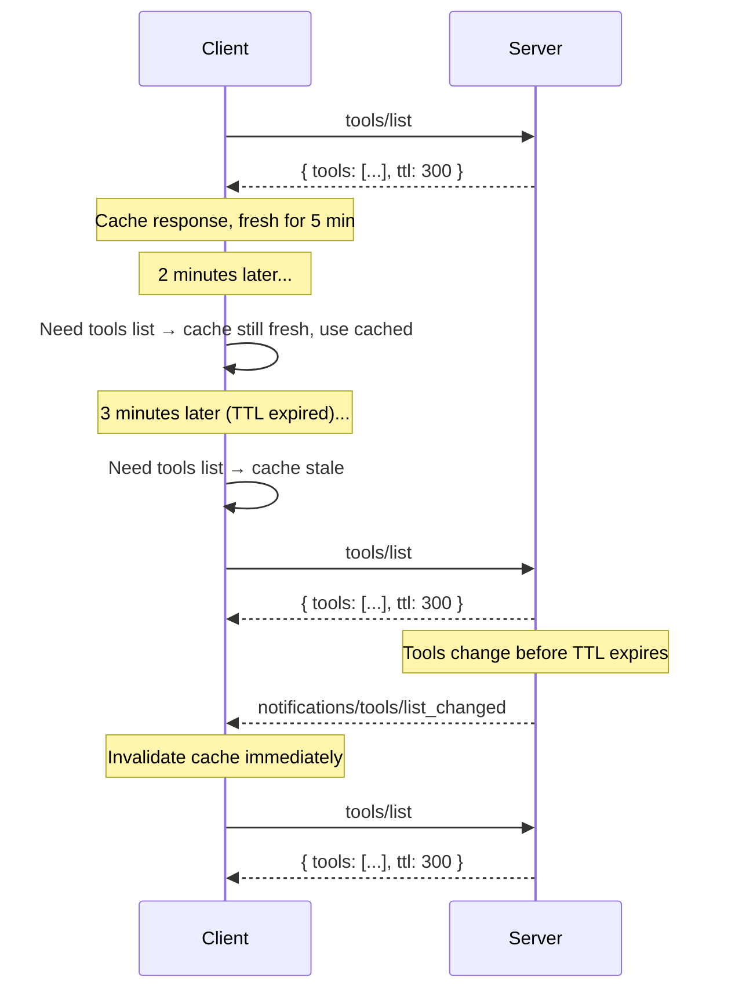

# SEP-XXXX: TTL for Server Features

- **Status**: Draft
- **Type**: Standards Track
- **Created**: 2026-04-09
- **Author(s)**: Caitie McCaffrey (@CaitieM20)
- **Sponsor**: @CaitieM20 
- **PR**: https://github.com/modelcontextprotocol/specification/pull/XXXX

## Abstract

This SEP proposes adding an optional `ttl` (time-to-live) field to the result objects returned by `tools/list`, `prompts/list`, `resources/list`, and `resources/templates/list`. The TTL tells clients how long the response may be considered fresh before re-fetching. This allows clients to cache feature lists and poll on a predictable schedule, reducing reliance on server-push `list_changed` notifications while remaining fully backward compatible. TTL supplements rather than replaces the existing notification mechanism — both can coexist.

## Motivation

Today, MCP clients discover server features by calling `tools/list`, `prompts/list`, `resources/list`, and `resources/templates/list`. These calls return the current set of features. To learn about changes, clients rely on `notifications/tools/list_changed`, `notifications/prompts/list_changed`, and `notifications/resources/list_changed` push notifications from the server.

This approach has several limitations:

1. **Stateless and HTTP-based transports**: Clients communicating over stateless transports (e.g., pure HTTP request/response without SSE or WebSocket) cannot receive server-push notifications. These clients have no guidance on when to re-poll and must either poll excessively or risk stale data.

2. **Implementation complexity**: Both clients and servers must implement notification subscription and delivery infrastructure. Many simple servers have feature lists that change infrequently (or never), yet must still support the notification machinery if they want clients to stay current.

3. **No freshness signal**: Even clients that can receive notifications have no indication of how "stable" a list is. A server whose tool list changes once a day and one whose list changes every second look identical to the client — both simply send notifications when changes occur. A TTL provides an explicit freshness hint.

4. **Alignment with web standards**: HTTP caching (`Cache-Control: max-age`) and DNS TTLs have long demonstrated that time-based freshness hints are a simple, well-understood mechanism for reducing unnecessary refetches. MCP can benefit from the same pattern.

Adding a TTL field to list responses solves all of these problems with a minimal, backward-compatible protocol change.

## Specification

### New field: `ttl`

An optional `ttl` field is added to the base `PaginatedResult` interface. Because `ListToolsResult`, `ListPromptsResult`, `ListResourcesResult`, and `ListResourceTemplatesResult` all extend `PaginatedResult`, the field is inherited by all four list result types.

#### Schema change (TypeScript)

```typescript
/** @internal */
export interface PaginatedResult extends Result {
  /**
   * An opaque token representing the pagination position after the last
   * returned result. If present, there may be more results available.
   */
  nextCursor?: Cursor;

  /**
   * An optional hint from the server indicating how long (in seconds) the
   * client MAY cache this response before re-fetching. Semantics are
   * analogous to HTTP Cache-Control max-age.
   *
   * - If absent, the client has no server-provided freshness guidance and
   *   SHOULD rely on notifications or its own heuristics.
   * - If 0, the client SHOULD re-fetch every time the list is needed and
   *   SHOULD NOT serve a cached copy.
   * - If positive, the client SHOULD consider the list fresh for this many
   *   seconds after receiving the response. The client SHOULD NOT re-fetch
   *   before the TTL expires unless it receives a list_changed notification.
   */
  ttl?: number;
}
```

> **Open Question — TTL format**: An alternative representation is an ISO 8601 duration string (e.g., `"PT5M"` for 5 minutes). Integer seconds are simpler, consistent with HTTP `max-age`, and easier to compare arithmetically. ISO 8601 durations are more human-readable and used in some Azure/AWS APIs. Community input is welcome on which format to adopt. The remainder of this specification uses integer seconds for illustration.

### Semantics

| Condition                                                    | Client behavior                                                                                      |
| ------------------------------------------------------------ | ---------------------------------------------------------------------------------------------------- |
| `ttl` absent                                                 | No freshness hint. Client SHOULD rely on `list_changed` notifications or poll at its own discretion. |
| `ttl` = 0                                                    | Do not cache. Client SHOULD re-fetch every time the list is needed.                                  |
| `ttl` > 0                                                    | Client SHOULD consider the response fresh for `ttl` seconds from receipt. Client SHOULD NOT re-fetch before the TTL expires. |
| `list_changed` notification received while TTL is active     | The notification invalidates the cached response. Client SHOULD re-fetch regardless of remaining TTL. |

#### Freshness calculation

A client records the local time at which the response was received (`t_received`). The response is considered **fresh** while `now < t_received + ttl`. Once the TTL expires the response is **stale** and the client SHOULD re-fetch on next access.

Clients SHOULD NOT treat TTL as a polling interval that triggers automatic background refetches. The TTL is a **freshness hint**: the client checks freshness when it needs the list, and re-fetches only if stale. Implementations that do choose to poll SHOULD apply jitter and backoff.

### Interaction with `list_changed` notifications

TTL and `list_changed` notifications are complementary:

- A server MAY provide `ttl` without advertising `listChanged: true` in its capabilities. In this case the client relies entirely on TTL. 
- A server MAY advertise `listChanged: true` **and** provide `ttl`. In this case the client can use the TTL to avoid unnecessary refetches between notifications, and the notification acts as an immediate invalidation signal.
- A server MAY advertise `listChanged: true` without providing `ttl`. Behavior is unchanged from today.
- A server SHOULD use one of the mechanisms (TTL or notifications) rather than neither, to ensure clients have some way to stay up to date.



### Interaction with pagination

When a list result includes `nextCursor` (indicating more pages), the `ttl` applies to the **entire paginated list**, not to individual pages. Specifically:

- The TTL SHOULD only appear on every page with the same value. Clients SHOULD use the TTL from the last page they fetched to determine freshness.
- When the TTL expires, the client SHOULD re-fetch from the beginning (without a cursor) to get the full updated list.

### No new capability flag

No new capability flag is needed. The `ttl` field is optional on the response object. Servers that do not wish to provide a TTL simply omit the field. Clients that do not understand the field ignore it per standard JSON handling of unknown properties.

### Error handling

- If `ttl` is present but is not a non-negative integer, the client SHOULD ignore it and behave as if it were absent.
- Clients MUST NOT treat a missing `ttl` as an implicit TTL of 0 or any other value.

## Rationale

### Why add TTL to `PaginatedResult` rather than each result type individually?

All four list result types extend `PaginatedResult`. Adding the field there avoids repetition and ensures any future list result types also inherit TTL support. This is consistent with how `nextCursor` is already defined.

`ListTaskResult` also inherits from `PaginatedResult`, but in the move to stateless transports this feature will be removed. So for simplicity we are adding it to `PaginatedResult` now and will remove it from `ListTaskResult` in a future SEP.

### Why not replace `list_changed` notifications?

Notifications provide immediate invalidation which is valuable for long-lived connections. TTL provides a complementary mechanism optimized for stateless transports and for reducing unnecessary polling. Both mechanisms serve different use cases and coexist naturally.

### Prior art

| System                         | Mechanism              | Notes                                                              |
| ------------------------------ | ---------------------- | ------------------------------------------------------------------ |
| HTTP `Cache-Control: max-age`  | Integer seconds        | The most widely deployed freshness hint in web infrastructure      |
| DNS TTL                        | Integer seconds        | Controls how long resolvers cache DNS records                      |
| GraphQL `@cacheControl`        | `maxAge` integer secs  | Per-field cache hints in GraphQL responses                         |
| gRPC `grpc-retry-pushback-ms`  | Milliseconds           | Server-provided retry hint (different use case, similar pattern)   |

Integer seconds is the most common representation across these systems.

### Why not use HTTP caching directly?

MCP is transport-agnostic. While HTTP-based transports could theoretically use `Cache-Control` headers, MCP also operates over stdio,  and supports pluggable transports where HTTP headers are may not be available. Embedding the TTL in the JSON response body ensures it works uniformly across all transports.

## Backward Compatibility

This change is fully backward compatible:

- The `ttl` field is optional. Existing servers that do not provide it continue to work unchanged.
- Existing clients that do not understand the field will ignore it, as MCP result objects permit additional properties via `[key: string]: unknown` on the `Result` base type.
- No existing fields or behaviors are modified or removed.
- No capability negotiation is required.

## Reference Implementation

_No reference implementation yet. 

---

## Open Questions

1. **TTL format — integer seconds vs. ISO 8601 duration**:
   - Integer seconds (e.g., `300`) are simpler, consistent with HTTP `max-age` and DNS TTLs, and trivial to compare.
   - ISO 8601 duration strings (e.g., `"PT5M"`) are more human-readable and self-documenting.
   - Current recommendation: integer seconds, but community feedback is welcome.

