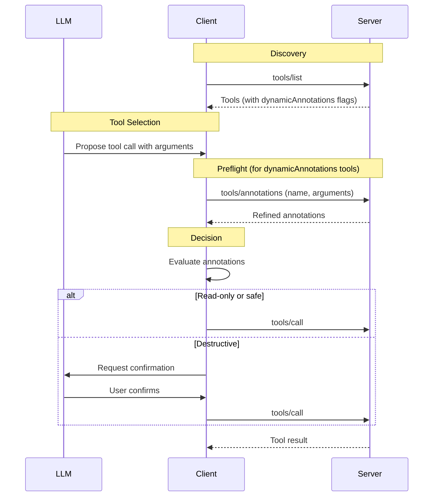

# SEP: Dynamic Tool Annotations

| Status        | Draft                                                                                          |
|:--------------|:-----------------------------------------------------------------------------------------------|
| Type          | Standards Track                                                                                |
| Created       | 2025-01-15                                                                                     |
| Authors       | @sammorrowdrums                                                                                |
| Sponsor       | TBD                                                                                            |
| PR            | TBD                                                                                            |

## Abstract

This SEP proposes a mechanism for servers to provide **argument-specific tool annotations** through a new `tools/annotations` request. Currently, tool annotations (such as `readOnlyHint`, `destructiveHint`, `idempotentHint`, and `openWorldHint`) are declared statically during `tools/list`. This limits their accuracy when a tool's behavior depends on its input arguments.

The proposal introduces:
1. A `dynamicAnnotations` field in the `Tool` definition indicating the tool supports runtime annotation queries
2. A new `tools/annotations` request that accepts tool name and arguments, returning refined annotations

This enables clients to make more informed decisions about tool invocations by querying annotations with specific arguments, similar to how CORS preflight requests determine permissions before cross-origin operations.

## Motivation

### The Problem with Static Annotations

Tool annotations provide hints about a tool's behavior:
- `readOnlyHint`: Whether the tool modifies its environment
- `destructiveHint`: Whether modifications are destructive vs. additive
- `idempotentHint`: Whether repeated calls have no additional effect
- `openWorldHint`: Whether the tool interacts with external systems

However, many tools have behavior that **depends on their arguments**. Consider these examples:

#### Example 1: File Management Tool
A `manage_files` tool with different actions:
- `read` action → read-only, safe
- `append` action → write, but additive only
- `replace` action → destructive (overwrites existing content)
- `delete` action → destructive, dangerous

With static annotations, the server must declare the worst-case scenario (`destructiveHint: true`), causing clients to present unnecessary confirmation dialogs for safe read operations.

#### Example 2: File System Tool
A `filesystem` tool with operation types:
- `read` operation → `readOnlyHint: true`
- `append` operation → `destructiveHint: false`
- `overwrite` operation → `destructiveHint: true`
- `delete` operation → `destructiveHint: true`

#### Example 3: API Client Tool
A `github_api` tool making REST calls:
- `GET /repos/:owner/:repo` → read-only
- `POST /repos/:owner/:repo/issues` → creates (additive)
- `DELETE /repos/:owner/:repo` → destructive

### Consequences of Static Over-Annotation

When tools must declare their worst-case behavior:
1. **Over-prompting**: Users see confirmation dialogs for safe operations
2. **Reduced trust**: LLMs may avoid tools marked as destructive even for safe uses
3. **Poor UX**: Every invocation of a versatile tool triggers warnings
4. **Loss of precision**: Clients cannot make nuanced decisions based on actual intent

### Why Not Separate Tools?

One workaround is to split tools by behavior (e.g., `database_read`, `database_write_additive`, `database_write_destructive`). This approach has significant drawbacks:

1. **Tool explosion**: Complex tools fragment into many variants
2. **Context pollution**: LLM context windows fill with near-duplicate tool definitions
3. **Lost semantics**: The unified concept of the tool is lost
4. **Maintenance burden**: Servers must duplicate logic across tools

## Specification

### Capability Declaration

Servers that support dynamic annotations **MUST** declare the capability:

```json
{
  "capabilities": {
    "tools": {
      "listChanged": true,
      "dynamicAnnotations": true
    }
  }
}
```

### Tool Definition Extension

Tools that support dynamic annotation queries **MUST** include the `dynamicAnnotations` field:

```typescript
interface Tool extends BaseMetadata {
  name: string;
  description?: string;
  inputSchema: { /* ... */ };
  annotations?: ToolAnnotations;
  
  /**
   * If true, this tool supports the `tools/annotations` request to provide
   * argument-specific annotations. Clients SHOULD query annotations with
   * specific arguments before invoking such tools when annotation accuracy
   * matters for user experience or safety decisions.
   * 
   * Default: false
   */
  dynamicAnnotations?: boolean;
}
```

When `dynamicAnnotations: true`, the `annotations` field **SHOULD** represent the worst-case (most conservative) behavior across all possible arguments, providing a safe default when dynamic queries are not supported or desired by the client.

### Protocol Messages

#### Request: `tools/annotations`

Clients send this request to obtain refined annotations for specific arguments:

**Request:**

```json
{
  "jsonrpc": "2.0",
  "id": 1,
  "method": "tools/annotations",
  "params": {
    "name": "manage_files",
    "arguments": {
      "path": "/home/user/notes.txt",
      "action": "read"
    }
  }
}
```

**Parameters:**

| Field      | Type               | Required | Description                                   |
|:-----------|:-------------------|:---------|:----------------------------------------------|
| name       | string             | Yes      | The name of the tool                          |
| arguments  | object             | Yes      | The arguments that will be passed to the tool |

#### Response: `tools/annotations`

**Response:**

```json
{
  "jsonrpc": "2.0",
  "id": 1,
  "result": {
    "annotations": {
      "readOnlyHint": true,
      "destructiveHint": false,
      "idempotentHint": true,
      "openWorldHint": false
    }
  }
}
```

**Result:**

| Field       | Type             | Required | Description                                          |
|:------------|:-----------------|:---------|:-----------------------------------------------------|
| annotations | ToolAnnotations  | Yes      | The refined annotations for the given arguments      |

### Schema Definitions

#### GetToolAnnotationsRequest

```typescript
/**
 * Request to get refined annotations for a tool with specific arguments.
 * 
 * @category `tools/annotations`
 */
export interface GetToolAnnotationsRequest extends JSONRPCRequest {
  method: "tools/annotations";
  params: {
    /**
     * The name of the tool to get annotations for.
     */
    name: string;
    
    /**
     * The arguments that will be passed to the tool. These arguments
     * allow the server to provide more precise annotation hints based
     * on the specific operation being performed.
     */
    arguments: { [key: string]: unknown };
  };
}
```

#### GetToolAnnotationsResult

```typescript
/**
 * Result of a tools/annotations request.
 * 
 * @category `tools/annotations`
 */
export interface GetToolAnnotationsResult extends Result {
  /**
   * The refined tool annotations based on the provided arguments.
   */
  annotations: ToolAnnotations;
}
```

### JSON Schema Additions

Add to `schema.json`:

```json
{
  "GetToolAnnotationsRequest": {
    "description": "Request to get refined annotations for a tool with specific arguments.",
    "properties": {
      "method": {
        "const": "tools/annotations",
        "type": "string"
      },
      "params": {
        "properties": {
          "name": {
            "description": "The name of the tool to get annotations for.",
            "type": "string"
          },
          "arguments": {
            "additionalProperties": {},
            "description": "The arguments that will be passed to the tool.",
            "type": "object"
          }
        },
        "required": ["name", "arguments"],
        "type": "object"
      }
    },
    "required": ["method", "params"],
    "type": "object"
  },
  "GetToolAnnotationsResult": {
    "description": "Result of a tools/annotations request.",
    "properties": {
      "annotations": {
        "$ref": "#/definitions/ToolAnnotations"
      }
    },
    "required": ["annotations"],
    "type": "object"
  }
}
```

### Behavior Requirements

#### Server Requirements

1. Servers **MUST** return annotations that accurately reflect the behavior for the given arguments
2. Servers **MUST** return the same annotations for identical (name, arguments) pairs within a session (determinism)
3. Servers **SHOULD** implement efficient annotation evaluation (avoid expensive computation)
4. Servers **MAY** return a subset of annotation fields; omitted fields retain their default values
5. Servers **MAY** provide worst-case annotations in the static `annotations` field as a fallback for error cases

#### Client Requirements

1. Clients **SHOULD** query `tools/annotations` before invoking tools with `dynamicAnnotations: true` when:
   - Making user-facing decisions (e.g., showing confirmation dialogs)
   - Providing context to LLMs about tool safety
2. Clients **SHOULD NOT** cache `tools/annotations` results across different argument values
3. Clients **MAY** skip the preflight for tools where static annotations are acceptable
4. If the server returns an error for `tools/annotations`:
   - Clients **MUST** fall back to static `annotations` if provided by the tool
   - If no static annotations are provided, clients **MUST** surface the error to the user
   - Clients **SHOULD** prefer retrying the `tools/annotations` request
   - Clients **MAY** proceed with the tool call without provided annotations due to error

#### Error Handling

Servers **SHOULD** return standard JSON-RPC errors:

| Code   | Message               | When                                           |
|:-------|:----------------------|:-----------------------------------------------|
| -32602 | Invalid params        | Unknown tool name or invalid arguments         |
| -32603 | Internal error        | Server failed to evaluate annotations          |

### Message Flow



## Rationale

### Design Decisions

#### Why a Separate Request (Not Extension of tools/call)?

1. **Non-blocking queries**: Clients can query annotations without committing to invocation
2. **Separation of concerns**: Annotation evaluation is distinct from tool execution
3. **Performance**: Servers can optimize annotation evaluation separately from execution
4. **Consistency with existing patterns**: Similar to CORS preflight in HTTP

#### Why "Preflight" Semantics?

The `tools/annotations` request mirrors CORS preflight requests:
- Both check permissions before performing an operation
- Both are lightweight compared to the actual operation
- Both allow the client to make informed decisions

#### Why Not Stream Annotations During Execution?

An alternative design could stream updated annotations during `tools/call`:

**Advantages of streaming:**
- Single request for annotation + execution
- Annotations could evolve during execution

**Disadvantages of streaming (why we chose preflight):**
- More complex protocol
- Cannot cancel based on annotations without already starting execution
- Mixes concerns of evaluation and execution
- Most tools know their annotations before execution begins

#### Why Boolean `dynamicAnnotations` vs. Explicit List?

A boolean keeps the API simple. Servers always return the full `ToolAnnotations` object from `tools/annotations`, allowing them to refine any annotation field. Future annotation additions automatically work without schema changes.

#### Why Require Determinism?

Determinism (same arguments → same annotations) ensures:
- A call to determine annotations should then be true when calling the tool
- Potential for safe response caching within a session
- Testable server implementations

### Alternatives Considered

#### Alternative 1: `tools/preflight` Method Name

A more generic name like `tools/preflight` was considered:

**Pros:**
- Familiar concept from web development
- Could be extended for other preflight needs

**Cons:**
- Less descriptive of the specific purpose
- `tools/annotations` directly maps to the returned type

We chose `tools/annotations` for clarity and consistency with the return type.

#### Alternative 2: Per-Argument Annotation Schema

Instead of runtime queries, annotate which arguments affect which hints:

```json
{
  "name": "manage_files",
  "annotations": {
    "argumentEffects": {
      "action": {
        "pattern": "^read$",
        "annotations": { "readOnlyHint": true }
      }
    }
  }
}
```

**Pros:**
- Static analysis possible
- No additional requests

**Cons:**
- Cannot express complex logic (semantic analysis, state-dependent behavior)
- Verbose for many cases
- Pattern matching is limited

## Backward Compatibility

This proposal is **fully backward compatible**:

### For Existing Servers
- No changes required
- Servers without `dynamicAnnotations` capability continue working
- Static `annotations` field remains authoritative

### For Existing Clients
- No changes required
- Clients can ignore `dynamicAnnotations: true` and use static annotations
- Tools remain fully functional without preflight queries

### Graceful Degradation
- Clients fall back to static annotations if `tools/annotations` fails
- Static annotations represent worst-case behavior, ensuring safety

## Security Implications

### Trust Model

Tool annotations are already marked as **untrusted** in the specification:

> For trust & safety and security, clients **MUST** consider tool annotations to be untrusted unless they come from trusted servers.

This trust model extends to dynamic annotations:

1. **Malicious servers** could return misleading annotations
   - Marking destructive operations as read-only
   - Marking data-exfiltrating tools as closed-world

2. **Mitigation**: Clients must apply the same trust evaluation to dynamic annotations as static ones

### Determinism and Side Effects

1. Servers **MUST NOT** perform side effects during `tools/annotations`
2. The request is for evaluation only, not execution
3. Implementations should be computationally efficient to prevent DoS

### Argument Validation

Servers **SHOULD** validate arguments in `tools/annotations` against the tool's `inputSchema`:
- Invalid arguments should return an error
- This provides consistent behavior between annotation queries and tool calls

## Reference Implementation

### Server Implementation (TypeScript)

```typescript
import { Server } from "@modelcontextprotocol/sdk/server/index.js";

const server = new Server({
  name: "file-server",
  version: "1.0.0",
}, {
  capabilities: {
    tools: {
      listChanged: false,
      dynamicAnnotations: true,
    },
  },
});

// Tool definition
server.setRequestHandler(ListToolsRequestSchema, async () => {
  return {
    tools: [{
      name: "manage_files",
      description: "Read, append, replace, or delete file contents",
      inputSchema: {
        type: "object",
        properties: {
          path: { type: "string", description: "File path to operate on" },
          action: { 
            type: "string", 
            enum: ["read", "append", "replace", "delete"],
            description: "Operation to perform" 
          },
          content: { type: "string", description: "Content for append/replace operations" }
        },
        required: ["path", "action"]
      },
      // Conservative default annotations
      annotations: {
        readOnlyHint: false,
        destructiveHint: true,
        idempotentHint: false,
        openWorldHint: false
      },
      // Indicates support for tools/annotations
      dynamicAnnotations: true
    }]
  };
});

// Dynamic annotations handler
server.setRequestHandler(GetToolAnnotationsRequestSchema, async (request) => {
  const { name, arguments: args } = request.params;
  
  if (name !== "manage_files") {
    throw new McpError(ErrorCode.InvalidParams, `Unknown tool: ${name}`);
  }
  
  const action = args.action as string;
  
  switch (action) {
    case "read":
      return {
        annotations: {
          readOnlyHint: true,
          destructiveHint: false,
          idempotentHint: true,
          openWorldHint: false
        }
      };
    
    case "append":
      return {
        annotations: {
          readOnlyHint: false,
          destructiveHint: false,  // Additive only
          idempotentHint: false,
          openWorldHint: false
        }
      };
    
    case "replace":
      return {
        annotations: {
          readOnlyHint: false,
          destructiveHint: true,
          idempotentHint: true,  // Same content = same result
          openWorldHint: false
        }
      };
    
    case "delete":
      return {
        annotations: {
          readOnlyHint: false,
          destructiveHint: true,
          idempotentHint: true,  // Deleting twice = same result
          openWorldHint: false
        }
      };
    
    default:
      // Default to conservative for unknown actions
      return {
        annotations: {
          readOnlyHint: false,
          destructiveHint: true,
          idempotentHint: false,
          openWorldHint: false
        }
      };
  }
});
```

### Client Implementation (TypeScript)

```typescript
import { Client } from "@modelcontextprotocol/sdk/client/index.js";

async function invokeToolSafely(
  client: Client,
  toolName: string,
  args: Record<string, unknown>
): Promise<CallToolResult> {
  // Get tool definition
  const { tools } = await client.listTools();
  const tool = tools.find(t => t.name === toolName);
  
  if (!tool) {
    throw new Error(`Unknown tool: ${toolName}`);
  }
  
  // Get annotations (dynamic if supported, static otherwise)
  let annotations = tool.annotations ?? {};
  
  if (tool.dynamicAnnotations) {
    try {
      const result = await client.request({
        method: "tools/annotations",
        params: { name: toolName, arguments: args }
      });
      annotations = result.annotations;
    } catch (error) {
      // Fall back to static annotations
      console.warn("Failed to get dynamic annotations, using static:", error);
    }
  }
  
  // Make safety decisions based on annotations
  if (annotations.destructiveHint) {
    const confirmed = await requestUserConfirmation(
      `This operation may be destructive. Proceed?`
    );
    if (!confirmed) {
      throw new Error("User cancelled destructive operation");
    }
  }
  
  // Invoke the tool
  return client.callTool({ name: toolName, arguments: args });
}
```

## Related Work

- **SEP-1076 (Dependency Annotations)**: Proposes additional annotations for network, filesystem, environment dependencies. Dynamic annotations complement this by allowing argument-specific refinement of any annotation field.
- **SEP-1300 (Tool Filtering)**: Addresses context window pressure through tool grouping. Dynamic annotations provide finer-grained information without requiring tool explosion.
- **CORS Preflight**: The `tools/annotations` pattern is directly inspired by HTTP CORS preflight requests, which check permissions before cross-origin operations.

## Open Questions

1. **Caching semantics**: Should clients be allowed to cache results for identical (name, arguments) pairs? The current proposal says no, but this could reduce latency for repeated operations.

2. **Partial arguments**: Should `tools/annotations` accept partial arguments and return annotations for the partially-specified operation? This could be useful for progressive disclosure.

3. **Annotation confidence**: Should servers be able to express confidence in their annotation evaluation (e.g., heuristic vs. certain)?
